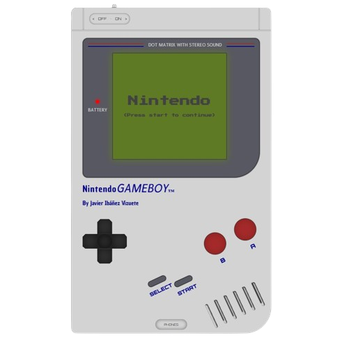
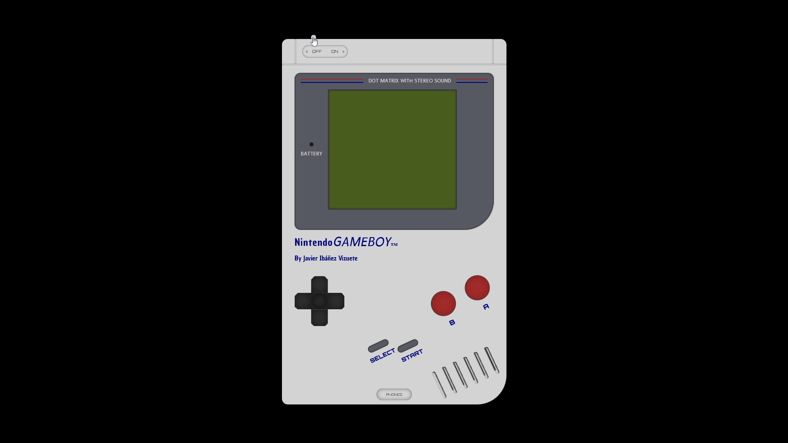

# Nientiendo Portfolio

Por Javier Ibáñez Vizuete

## Descripción

Este proyecto es un portfolio web interactivo inspirado en el diseño retro de una Gameboy. La web permite explorar secciones como biografia, experiencia, proyectos, hobbies y contacto, utilizando elementos visuales y animaciones para brindar una experiencia única y envolvente.

## Caracteristicas Principales

- Navegación interactiva simulando una consola retro.
- Diseño responsive y estilizado con animaciones personalizadas.
- Secciones detalladas:
  - **Biografia:** Trayectoria personal y profesional.
  - **Experiencia:** Resumen laboral con detalles de roles y ubicaciones.
  - **Proyectos:** Muestras destacadas con enfoque HTML y CSS.
  - **Hobbies:** Actividades personales destacadas.
  - **Contacto:** Enlaces directos a redes sociales y correo electronico.
- Animacinoes complejas para una experiencia visual dinamica.
- Paleta de colores retro bien definida.

## Captura de Pantalla
### Vista Previa Web

### Encendido Gameboy


### Navegacion en Gameboy


## Estructura del Proyecto

El proyecto está estructurado de la siguiente manera:

```
├── .git/
|
├── media/
| ├── gif/
| | └── mario-running.
| |
│ ├── icons/
| | ├── icons-arrows/
| | | ├── icon-down-arrow/
| | | | ├── Todos los formatos de las imagenes de los iconos de flechas abajo.
| | | | └── icon-down-arrow-black.png
| | | |
| | | └── icon-up-arrow/
| | |   ├── Todos los formatos de las imagenes de los iconos de flechas arriba
| | |   └── icon-up-arrow-black.png
| | |
| | ├── icons-email/
| | | ├── Todos los formatos de imagenes de los iconos de imael
| | | └── incon-email.png
| | |
| | ├── icons-explosion/
| | | └── explosion-icon.png
| | |
| | └── icons-help/
| |   ├── Todos los formatos de imagenes de los iconos de Ayuda
| |   └── icon-help.png
| |
│ ├── images/
| | ├── bombs/
| | | └──bullet-bill-bomb.png
| | |
| | ├── buttons/
| | | ├── Todos los formatos de imagenes de los botones
| | | └── select-button.png
| | |
| | ├── hobbies-page/
| | | ├── gaming/
| | | | ├── Todos los formatos de imagenes de Gaming
| | | | └── hobby-gaming-twitch.png
| | | |
| | | └── sports/
| | |   ├── Todos los formatos de imagenes de Sports
| | |   └── image-hobby-sport-parachuting.png
| | |
| | ├── juario-message/
| | | ├── Todos los formatos de imagenes de Juario
| | | └── juario-say-hello.png
| | |
| | ├── ladrillos/
| | | ├── Todos los formatos de imagenes de ladrillos
| | | └── ladrillo-mario.png
| | |
| | ├── princess-castle/
| | | ├── Todos los formatos de imagenes de Castillos
| | | └── image-princess-castle.png
| | |
| | ├── paisaje/
| | | ├── Todos los formatos de imagenes de Paisaje
| | | └── background-bricks.png
| | |
| | ├── superjuario-pointer/
| | | ├── Todos los formatos de imagenes de Superjuario Pointer
| | | └── superjuario-pointing.png
| | |
| | ├── superjuario-remember/
| | | ├── Todos los formatos de imagenes de Superjuario Remember
| | | └── superjuario-remember.png
| | |
| | ├── wiked-mushroom/
| | | └── image-mushroom.png
| | |
│ | ├── image-favicon.avif
│ | ├── image-favicon.png
│ | └── image-link-nientiendo-porfolio.jpg
│ | └── image-link-nientiendo-porfolio.png
│ |
│ └── logos/
│   ├── github/
|   | ├── Todos los formatos de imagenes de los logos de Github
|   | └── github-logo-pixel.png
|   |
│   ├── instagram/
|   | ├── Todos los formatos de imagenes de los logos de Instagram
|   | └── logo-instagram.png
|   |
│   ├── linkedin/
|   | ├── Todos los formatos de imagenes de los logos de Linkedin
|   | └── logo-linkedin.png
|   |
│   └── rocket418/
|     ├── Todos los formatos de imagenes de los logos de Rocket418
|     └── logo-experience-rocket418.png
|
├── resources/
| ├── ejemplo-nintendo-gameboy-classic.jpg
| └── gameboy-classic-colors.png
|
├── styles/
│ ├── global.css
│ ├── index.css
│ └── responsive.css
│
├── .gitignore
├── .prettierrc
├── index.html
├── LICENSE
└── README.md
```

## Enlace del proyecto

https://nientiendo-portfolio.netlify.app

## Caracteristicas principales

- Contenido 100% responsivo.
- Performance aplicado en todo el proyecto.
- Estructura semantica adecuada.

## Proceso

- El proyecto comenzó como un reto derivado de otro portfolio que realicé (https://javier-ibanez.netlify.app), utilizando exclusivamente HTML y CSS puro. La idea era representar mucho más de mí, incluyendo mi pasión por los videojuegos. Por ello, intenté recrear una Game Boy clásica, haciendo que todas las interacciones en el proyecto se ejecutaran a través de los botones tradicionales de la Game Boy. De esta forma, buscaba darle un toque inmersivo y, al mismo tiempo, intuitivo.

## Recursos Utiles

- Squoosh (Utilizado para realizar el performance de todas las imagenes).
- remove bg (utilizado para eliminar de forma precisa el fondo de algunas imagenes).
- Pinetools (utilizado para pixelar las imagenes).
- Css Portal (utilizado para generar Clip-Path de forma sencilla y fácil).
- Css Matic (utilizado para generar box-shadows de forma rapida y profesional).
